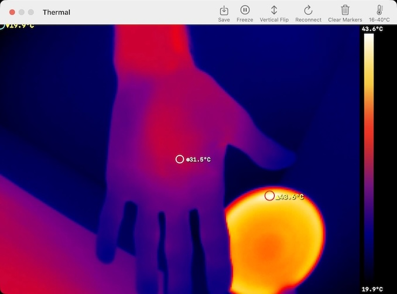
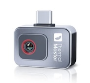

# Thermal

macOS native app for previewing thermal camera images



### Warning: Code was written with LLM/Agentic/vibe coding. Do not use it in production.

## Description


The goal was to create simple, native, no dependency app that displays IR image.

Program weights 80kB (36kB after `strip`), uses AppKit for UI and AVFoundation for the video.

It autoranges the temperature palette by default, measures coldest/hottest, center and user clickable point, can freeze frame and export current image as PNG.

## Build

```
make
```

## Supported devices

Only tested with Thermal Master P2, might support other deviecs with the same frame format and resolution.



## Info about camera
```
[avfoundation @ 0x9a9058000] Supported modes:
[avfoundation @ 0x9a9058000]   256x194@[25.000000 25.000000]fps
[avfoundation @ 0x9a9058000]   256x386@[25.000000 25.000000]fps

$ cyme -vvv
  0   1  0x3474 0x4281 Camera 202206223 480.0 Mb/s
   1 󰚥   100 mA Configuration
    0-1:1.0  0x00 Video 0x01 0x00 Camera
       3 In  Interrupt None  Data  1x 64 
    0-1:1.1  0x00 Video 0x02 0x00 -     
    0-1:1.1  0x01 Video 0x02 0x00 -     
       1 In  Isochronous Asynchronous Data  1x 1024

```

Full usb info: [here](docs/usb_info.json)